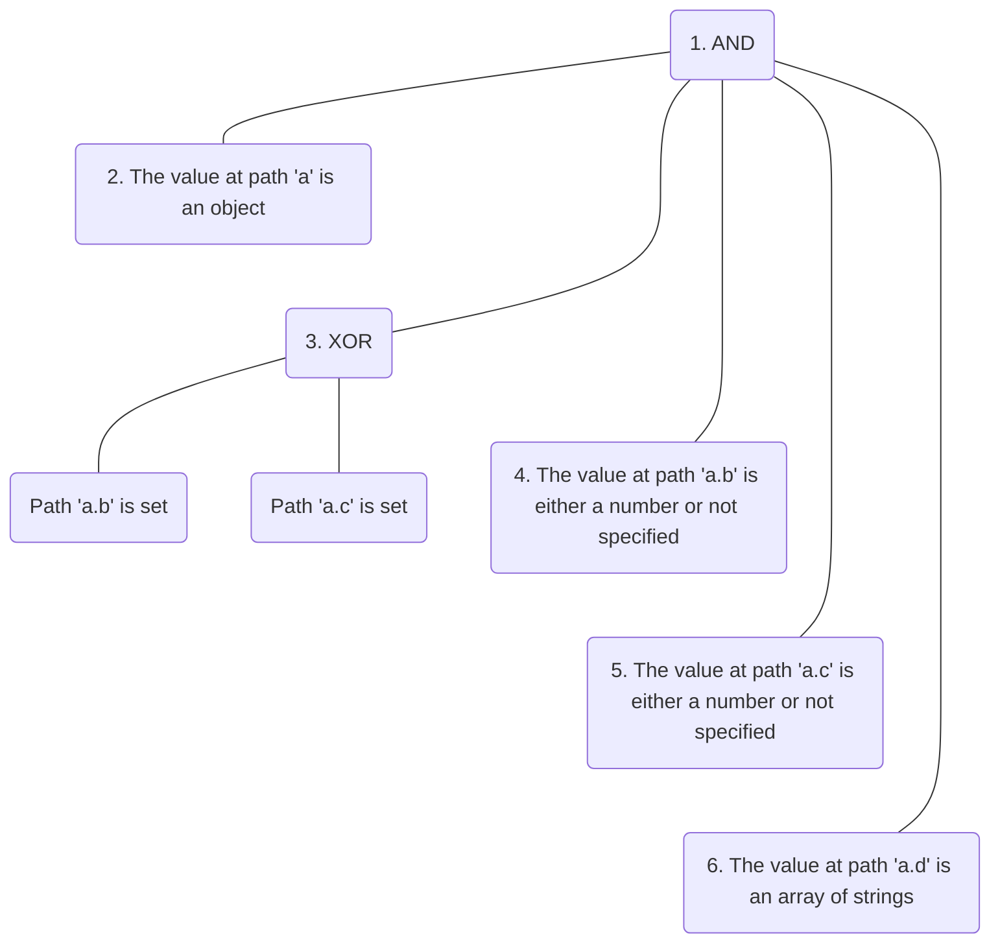

# Smart Validator

[](https://travis-ci.org/davebaol/smart-validator) [](https://codecov.io/github/davebaol/smart-validator) [](https://david-dm.org/davebaol/smart-validator) [](https://david-dm.org/davebaol/smart-validator?type=dev) [](https://opensource.org/licenses/MIT)

## Table of Contents
- [Intro](#intro)
- [Usage](#usage)
  - [Hard-coded Validators](#hard-coded-validators)
  - [Loading Validators from File](#loading-validators-from-file)
  - [YAML vs JSON](#yaml-vs-json)
  - [Shortcut for optional paths](#shortcut-for-optional-paths)
- [Leaf Validators](#leaf-validators)
- [Branch Validators](#branch-validators)

## Intro
Hierarchical Rule-Based Validator is a simple yet powerful data validation engine. Unlike schema-based validation libraries, this framework allows you to compose validation rules in higher order rules to validate complex data structures.

Major supported features are:

- Both browsers and NodeJS supported
- Validators defined either in code or using JSON/YAML syntax in a declarative way
- Rich set of leaf validators (most from [validator](https://www.npmjs.com/package/validator) and the others implemented internally) to check field values and types
- Branch validators to compose validators in a hierarchical way through:
  - Iterative validation on array elements and object properties
  - Recursive validation
  - Logical operators
  - Conditional validation

## Usage
Suppose you have the simple object below

```javascript
let toBeValidated = {
  a: {
    b: 1,
    c: true,
    d: ["foo", "bar"]
  }
};
```
and you want to validate it like that:
1. All next rules must be satisfied (logical and)
1. The value at path `a` is an object
1. Paths `a.b` and `a.c` are mutually exclusive (logical xor)
1. The value at path `a.b` is a number (whenever set)
1. The value at path `a.c` is a boolean (whenever set)
1. The value at path `a.d` is an array of strings

By the way, such a validator is expected to fail against the object above, because both paths `a.b` and `a.c` are set, thus breaking rule 3 which in turn breaks rule 1.

Notice that you can easily represent previous rules with the following tree:


<!--
Unfortunately github is not able to render mermaid graphs so we have to use a .png and comment the graph :(


-->

To create this validator you can choose one of the two approaches described in the following: 
- [Hard-coded Validators](#hard-coded-validators)
- [Loading Validators from File](#loading-validators-from-file)

### Hard-coded validators

This sample code programmatically creates the validator for the previous rules.
```javascript
const V = require("smart-validator");

// Hard-coded validator
let validator = V.and(              // Rule 1
  V.isType("a", "object"),          //   Rule 2
  V.xor(                            //   Rule 3
    V.isSet("a.b"),                 //     Rule 3.1
    V.isSet("a.c"),                 //     Rule 3.2
  ),
  V.optIsType("a.b", "number"),     //   Rule 4
  V.optIsType("a.c", "boolean"),    //   Rule 5
  V.isArrayOf("a.d", "string")      //   Rule 6
);

// Validate
let vError = validator(toBeValidated);
```
Notice that this is a tree-like structure where`and` and `xor` are **branch validators** made of children that, in turn, are validators.
The others are **leaf validators** with no children.


### Loading validators from file

You use a simple tree-like DSL to define your validator. For instance, our sample validator becomes the *YAML* file below:
```yaml
and:
  - isType: [a, object]
  - xor:
    - isSet: [a.b]
    - isSet: [a.c]
  - optIsType: [a.b, number]
  - optIsType: [a.c, boolean]
  - isArrayOf: [a.d, string]
```
Here each validator is an object with exactly one property where the key is its name and the value is the array of its arguments. They look like, and in fact they are, regular function calls.

For convenience, **leaf validators** are represented as an in-line object, while **branch validators** span multiple lines in a tree-like structure.

To load the validator you can use the sample code below:

```javascript
const fs = require("fs");
const yaml = require("js-yaml");
const vUtil = require("smart-validator/util");

// Load validator from file
let vObj = yaml.safeLoad(fs.readFileSync("/path/to/validator/file", 'utf8'));
let validator = vUtil.ensureValidator(vObj);

// Validate
let vError = validator(toBeValidated);
```


### YAML vs JSON

The choice between *YAML* and *JSON* formats depends on your scenario.

When **human-readability** is important for you, it's recommended to use *YAML* instead of *JSON*. For instance, previous [YAML file](#loading-validators-from-file) converted to JSON, while keeping similar formatting, becomes like this:
```json
{"and": [
	{"isType": ["a", "object"]},
	{"xor": [
		{"isSet": ["a.b"]},
		{"isSet": ["a.c"]}
	]},
	{"optIsType": ["a.b", "number"]},
	{"optIsType": ["a.c", "boolean"]},
	{"isArrayOf": ["a.d", "string"]}
]}
```
:astonished: So many braces, double quotes and commas!
Imagine what would happen for a larger real-world validator.

On the other hand, for **machine to machine communication** *JSON* is likely a  more appropriate format. For instance, think of a REST API centralizing configurations and their validators.


### Shortcut for optional paths

Each validator `xyz(path, ...args)`, no matter whether it is leaf or branch, that takes a path as the first argument has a counterpart validator `optXyz(path, ...args)`:
- **optXyz(path, ...args)**: Check if the value at `path` is not set or passes validator `xyz`.

This shortcut is equivalent to the composite validator
```javascript
  V.or(
    V.not(V.isSet(path)),
    V.xyz(path, ...args)
  )
```
Notice that for a couple of validators the shortcut is somewhat redundant. For instance,
- `V.optIsSet("a")` is always valid, since that path `a` cannot be set and null at the same time
- `V.optIsType("a", "string")` is equivalent to `V.isType("a", ["null", "string"])`


## Leaf Validators

Here is a list of the leaf validators currently available.

Keep in mind that all leaf validators, without exception, have their shortcut opt (not reported in the list below).

Leaf Validator                          | Description
:---------------------------------------|:--------------------------------------
**contains(path, seed)**               | Check if the value at `path` is a string containing the `seed`.
**equals(path, value)**                | Check if the value at `path` is equal to the `value`.
**isAfter(path [, date])**:raised_hand: | Check if the value at `path` is a string representing a date that's after the specified date (defaults to now).
**isAlpha(path [, locale])**           | Check if the value at `path` is a string containing only letters (a-zA-Z).<br/><br/>Locale is one of `['ar', 'ar-AE', 'ar-BH', 'ar-DZ', 'ar-EG', 'ar-IQ', 'ar-JO', 'ar-KW', 'ar-LB', 'ar-LY', 'ar-MA', 'ar-QA', 'ar-QM', 'ar-SA', 'ar-SD', 'ar-SY', 'ar-TN', 'ar-YE', 'bg-BG', 'cs-CZ', 'da-DK', 'de-DE', 'el-GR', 'en-AU', 'en-GB', 'en-HK', 'en-IN', 'en-NZ', 'en-US', 'en-ZA', 'en-ZM', 'es-ES', 'fr-FR', 'hu-HU', 'it-IT', 'ku-IQ', 'nb-NO', 'nl-NL', 'nn-NO', 'pl-PL', 'pt-BR', 'pt-PT', 'ru-RU', 'sl-SI', 'sk-SK', 'sr-RS', 'sr-RS@latin', 'sv-SE', 'tr-TR', 'uk-UA']`) and defaults to `en-US`. Locale list is `require('validator').isAlphaLocales`.
**isAlphanumeric(path [, locale])**    | Check if the value at `path` is a string containing only letters and numbers.<br/><br/>Locale is one of `['ar', 'ar-AE', 'ar-BH', 'ar-DZ', 'ar-EG', 'ar-IQ', 'ar-JO', 'ar-KW', 'ar-LB', 'ar-LY', 'ar-MA', 'ar-QA', 'ar-QM', 'ar-SA', 'ar-SD', 'ar-SY', 'ar-TN', 'ar-YE', 'bg-BG', 'cs-CZ', 'da-DK', 'de-DE', 'el-GR', 'en-AU', 'en-GB', 'en-HK', 'en-IN', 'en-NZ', 'en-US', 'en-ZA', 'en-ZM', 'es-ES', 'fr-FR', 'hu-HU', 'it-IT', 'ku-IQ', 'nb-NO', 'nl-NL', 'nn-NO', 'pl-PL', 'pt-BR', 'pt-PT', 'ru-RU', 'sl-SI', 'sk-SK', 'sr-RS', 'sr-RS@latin', 'sv-SE', 'tr-TR', 'uk-UA']`) and defaults to `en-US`. Locale list is `require('validator').isAlphanumericLocales`.
**isArrayOf(path, type)**              | Check if the value at `path` is an array whose items have either the specified type (if type is a string) or one of the specified types (if type is an array of strings). Supported types are: "array", "boolean", "null", "number", "object", "regex", "string".
**isAscii(path)**                      | Check if the value at `path` is a string containing ASCII chars only.
**isBase64(path)**                     | Check if the value at `path` is a base64 encoded string.
**isAfter(path [, date])**:raised_hand: | Check if the value at `path` is a string representing a date that's after the specified date (defaults to now).
**isBefore(path [, date])** :raised_hand: | Check if the value at `path` is a string a date that's before the specified date.
**isBetween(path, lower, upper)**      | Check if the value at `path` is in the range [`lower`, `upper`]
**isBoolean(path)** :raised_hand::raised_hand:      | Check if a string is a boolean.
**isByteLength(path [, options])**     | Check if the value at `path` is a stringwhose length (in UTF-8 bytes) falls in the specified range.<br/><br/>`options` is an object which defaults to `{min:0, max: undefined}`.
**isCreditCard(path)**                 | Check if the value at `path` is a string representing a credit card.
**isAfter(path [, date])**:raised_hand: | Check if the value at `path` is a string representing a date that's after the specified date (defaults to now).
**isDataURI(path)**                      | Check if the value at `path` is a string representing a [data uri format](https://developer.mozilla.org/en-US/docs/Web/HTTP/data_URIs).
**isDate(path)*                          |
**isDecimal(path [, options])** :raised_hand:            | Check if the string represents a decimal number, such as 0.1, .3, 1.1, 1.00003, 4.0, etc.<br/><br/>`options` is an object which defaults to `{force_decimal: false, decimal_digits: '1,', locale: 'en-US'}`<br/><br/>`locale` determine the decimal separator and is one of `['ar', 'ar-AE', 'ar-BH', 'ar-DZ', 'ar-EG', 'ar-IQ', 'ar-JO', 'ar-KW', 'ar-LB', 'ar-LY', 'ar-MA', 'ar-QA', 'ar-QM', 'ar-SA', 'ar-SD', 'ar-SY', 'ar-TN', 'ar-YE', 'bg-BG', 'cs-CZ', 'da-DK', 'de-DE', 'en-AU', 'en-GB', 'en-HK', 'en-IN', 'en-NZ', 'en-US', 'en-ZA', 'en-ZM', 'es-ES', 'fr-FR', 'hu-HU', 'it-IT', 'ku-IQ', nb-NO', 'nl-NL', 'nn-NO', 'pl-PL', 'pt-BR', 'pt-PT', 'ru-RU', 'sl-SI', 'sr-RS', 'sr-RS@latin', 'sv-SE', 'tr-TR', 'uk-UA']`.<br/>**Note:** `decimal_digits` is given as a range like '1,3', a specific value like '3' or min like '1,'.
**isDivisibleBy(path, number)**  :raised_hand:        | Check if the value at `path` is a string representing a number that's divisible by another.
**isEmail(path [, options])**            | Check if the value at `path` is a string representing an email.<br/><br/>`options` is an object which defaults to `{ allow_display_name: false, require_display_name: false, allow_utf8_local_part: true, require_tld: true, allow_ip_domain: false, domain_specific_validation: false }`. If `allow_display_name` is set to true, the validator will also match `Display Name <email-address>`. If `require_display_name` is set to true, the validator will reject strings without the format `Display Name <email-address>`. If `allow_utf8_local_part` is set to false, the validator will not allow any non-English UTF8 character in email address' local part. If `require_tld` is set to false, e-mail addresses without having TLD in their domain will also be matched. If `allow_ip_domain` is set to true, the validator will allow IP addresses in the host part. If `domain_specific_validation` is true, some additional validation will be enabled, e.g. disallowing certain syntactically valid email addresses that are rejected by GMail.
**isEmpty(path [, options])** :raised_hand:           | Check if the string has a length of zero.<br/><br/>`options` is an object which defaults to `{ ignore_whitespace:false }`.
**isFloat(path [, options])** :raised_hand:           | Check if the string is a float.<br/><br/>`options` is an object which can contain the keys `min`, `max`, `gt`, and/or `lt` to validate the float is within boundaries (e.g. `{ min: 7.22, max: 9.55 }`) it also has `locale` as an option.<br/><br/>`min` and `max` are equivalent to 'greater or equal' and 'less or equal', respectively while `gt` and `lt` are their strict counterparts.<br/><br/>`locale` determine the decimal separator and is one of `['ar', 'ar-AE', 'ar-BH', 'ar-DZ', 'ar-EG', 'ar-IQ', 'ar-JO', 'ar-KW', 'ar-LB', 'ar-LY', 'ar-MA', 'ar-QA', 'ar-QM', 'ar-SA', 'ar-SD', 'ar-SY', 'ar-TN', 'ar-YE', 'bg-BG', 'cs-CZ', 'da-DK', 'de-DE', 'en-AU', 'en-GB', 'en-HK', 'en-IN', 'en-NZ', 'en-US', 'en-ZA', 'en-ZM', 'es-ES', 'fr-FR', 'hu-HU', 'it-IT', 'nb-NO', 'nl-NL', 'nn-NO', 'pl-PL', 'pt-BR', 'pt-PT', 'ru-RU', 'sl-SI', 'sr-RS', 'sr-RS@latin', 'sv-SE', 'tr-TR', 'uk-UA']`. Locale list is `require('validator').isFloatLocales`.
**isFQDN(path [, options])**             | Check if the value at `path` is a string representing a fully qualified domain name (e.g. domain.com).<br/><br/>`options` is an object which defaults to `{ require_tld: true, allow_underscores: false, allow_trailing_dot: false }`.
**isFullWidth(path)**                    | Check if the value at `path` is a string containing any full-width chars.
**isGreaterThan(path, value)**           | Check if the value at `path` is greater than `value`
**isGreaterThanOrEquals(path, value)**   | Check if the value at `path` is greater than or equal to `value`
**isHalfWidth(path)**                    | Check if the value at `path` is a string containing any half-width chars.
**isHash(path, algorithm)**              | Check if the value at `path` is a string representing a hash of type algorithm.<br/><br/>Algorithm is one of `['md4', 'md5', 'sha1', 'sha256', 'sha384', 'sha512', 'ripemd128', 'ripemd160', 'tiger128', 'tiger160', 'tiger192', 'crc32', 'crc32b']`
**isHexadecimal(path)** :raised_hand:                 | Check if the string is a hexadecimal number.
**isHexColor(path)**                     | Check if the value at `path` is a string representing a hexadecimal color.
**isIdentityCard(path [, locale])**      | Check if the value at `path` is a string representing a valid identity card code.<br/><br/>`locale` is one of `['ES']` OR `'any'`. If 'any' is used, function will Check if any of the locals match.<br/><br/>Defaults to 'any'.
**isIn(path, values)** :exclamation:     | Check if the string is in a array of allowed values. Removed in favour of isOneOf.
**isInt(path [, options])** :raised_hand:             | Check if the string is an integer.<br/><br/>`options` is an object which can contain the keys `min` and/or `max` to check the integer is within boundaries (e.g. `{ min: 10, max: 99 }`). `options` can also contain the key `allow_leading_zeroes`, which when set to false will disallow integer values with leading zeroes (e.g. `{ allow_leading_zeroes: false }`). Finally, `options` can contain the keys `gt` and/or `lt` which will enforce integers being greater than or less than, respectively, the value provided (e.g. `{gt: 1, lt: 4}` for a number between 1 and 4).
**isIP(path [, version])**               | Check if the value at `path` is a string representing an IP (version 4 or 6).
**isIPRange(path)**                      | Check if the value at `path` is a string representing an IP Range(version 4 only).
**isISBN(path [, version])**             | Check if the value at `path` is a string representing an ISBN (version 10 or 13).
**isISIN(path)**                         | Check if the value at `path` is a string representing an [ISIN][ISIN] (stock/security identifier).
**isISO31661Alpha2(path)**               | Check if the value at `path` is a string representing a valid [ISO 3166-1 alpha-2](https://en.wikipedia.org/wiki/ISO_3166-1_alpha-2) officially assigned country code.
**isISO31661Alpha3(path)**               | Check if the value at `path` is a string representing a valid [ISO 3166-1 alpha-3](https://en.wikipedia.org/wiki/ISO_3166-1_alpha-3) officially assigned country code.
**isISO8601(path)**                      | Check if the value at `path` is a string representing a valid [ISO 8601](https://en.wikipedia.org/wiki/ISO_8601) date; for additional checks for valid dates, e.g. invalidates dates like `2009-02-29`, pass `options` object as a second parameter with `options.strict = true`.
**isISRC(path)**                         | Check if the value at `path` is a string representing a [ISRC](https://en.wikipedia.org/wiki/International_Standard_Recording_Code).
**isISSN(path [, options])**             | Check if the value at `path` is a string representing an [ISSN](https://en.wikipedia.org/wiki/International_Standard_Serial_Number).<br/><br/>`options` is an object which defaults to `{ case_sensitive: false, require_hyphen: false }`. If `case_sensitive` is true, ISSNs with a lowercase `'x'` as the check digit are rejected.
**isJSON(path)**                         | Check if the value at `path` is a string representing valid JSON (note: uses JSON.parse).
**isJWT(path)**                          | Check if the value at `path` is a string representing valid JWT token.
**isLatLong(path)**                      | Check if the value at `path` is a string representing a valid latitude-longitude coordinate in the format `lat,long` or `lat, long`.
**isLength(path [, options])**           | Check if the value at `path` is a string, an array or an object whose length falls in the specified range.<br/><br/>`options` is an object which defaults to `{min:0, max: Infinity}`. 
**isLessThan(path, value)**           | Check if the value at `path` is less than `value`
**isLessThanOrEquals(path, value)**   | Check if the value at `path` is less than or equal to `value`
**isLowercase(path)**                    | Check if the value at `path` is a string in lowercase.
**isMACAddress(path)**                   | Check if the value at `path` is a string representing a MAC address.<br/><br/>`options` is an object which defaults to `{no_colons: false}`. If `no_colons` is true, the validator will allow MAC addresses without the colons.
**isMagnetURI(path)**                    | Check if the value at `path` is a string representing a [magnet uri format](https://en.wikipedia.org/wiki/Magnet_URI_scheme).
**isMD5(path)**                          | Check if the value at `path` is a string representing a MD5 hash.
**isMimeType(path)**                     | Check if the string matches to a valid [MIME type](https://en.wikipedia.org/wiki/Media_type) format
**isMobilePhone(path [, locale [, options]])**          | Check if the value at `path` is a string representing a mobile phone number,<br/><br/>(locale is either an array of locales (e.g `['sk-SK', 'sr-RS']`) OR one of `['ar-AE', 'ar-DZ', 'ar-EG', 'ar-IQ', ar-JO', 'ar-KW', 'ar-SA', 'ar-SY', 'ar-TN', 'be-BY', 'bg-BG', 'bn-BD', 'cs-CZ', 'de-DE', 'da-DK', 'el-GR', 'en-AU', 'en-CA', 'en-GB', 'en-GH', 'en-HK', 'en-IE', 'en-IN',  'en-KE', 'en-MU', en-NG', 'en-NZ', 'en-RW', 'en-SG', 'en-UG', 'en-US', 'en-TZ', 'en-ZA', 'en-ZM', 'en-PK', 'es-ES', 'es-MX', 'es-UY', 'et-EE', 'fa-IR', 'fi-FI', 'fr-FR', 'he-IL', 'hu-HU', 'id-ID', 'it-IT', 'ja-JP', 'kk-KZ', 'ko-KR', 'lt-LT', 'ms-MY', 'nb-NO', 'nn-NO', 'pl-PL', 'pt-PT', 'pt-BR', 'ro-RO', 'ru-RU', 'sl-SI', 'sk-SK', 'sr-RS', 'sv-SE', 'th-TH', 'tr-TR', 'uk-UA', 'vi-VN', 'zh-CN', 'zh-HK', 'zh-TW']` OR defaults to 'any'. If 'any' or a falsey value is used, function will Check if any of the locales match).<br/><br/>`options` is an optional object that can be supplied with the following keys: `strictMode`, if this is set to `true`, the mobile phone number must be supplied with the country code and therefore must start with `+`. Locale list is `require('validator').isMobilePhoneLocales`.
**isMongoId(path)**                      | Check if the value at `path` is a string representing a valid hex-encoded representation of a [MongoDB ObjectId][mongoid].
**isMultibyte(path)**                    | Check if the value at `path` is a string containing one or more multibyte chars.
isNotEmpty |
**isNumeric(path [, options])**          | Check if the value at `path` is a string containing only numbers.<br/><br/>`options` is an object which defaults to `{no_symbols: false}`. If `no_symbols` is true, the validator will reject numeric strings that feature a symbol (e.g. `+`, `-`, or `.`).
**isOneOf(path, values)**                | Check if the value at `path` belongs to the specified array of primitive values (string, number, boolean).
**isPort(path)**                         | Check if the value at `path` is either a string or a number representing a valid port.
**isPostalCode(path, locale)**           | Check if the value at `path` is a string representing a postal code,<br/><br/>(locale is one of `[ 'AD', 'AT', 'AU', 'BE', 'BG', 'CA', 'CH', 'CZ', 'DE', 'DK', 'DZ', 'EE', 'ES', 'FI', 'FR', 'GB', 'GR', 'HR', 'HU', 'IL', 'IN', 'IS', 'IT', 'JP', 'KE', 'LI', 'LT', 'LU', 'LV', 'MX', 'NL', 'NO', 'PL', 'PT', 'RO', 'RU', 'SA', 'SE', 'SI', 'TN', 'TW', 'UA', 'US', 'ZA', 'ZM' ]` OR 'any'. If 'any' is used, function will Check if any of the locals match. Locale list is `require('validator').isPostalCodeLocales`.).
**isRFC3339(path)**                      | Check if the value at `path` is a string representing a valid [RFC 3339](https://tools.ietf.org/html/rfc3339) date.
**isSet(path)**                          | Check if the value at `path` is a non null value.
**isSurrogatePair(path)**                | Check if the value at `path` is a string containing any surrogate pairs chars.
**isType(path, type)**                   | Check if the value at `path` has either the specified type (if type is a string) or one of the specified types (if type is an array of strings). Supported types are: "array", "boolean", "null", "number", "object", "regex", "string".
**isUppercase(path)**                    | Check if the value at `path` is a string in uppercase.
**isURL(path [, options])**              | Check if the value at `path` is a string representing an URL.<br/><br/>`options` is an object which defaults to `{ protocols: ['http','https','ftp'], require_tld: true, require_protocol: false, require_host: true, require_valid_protocol: true, allow_underscores: false, host_whitelist: false, host_blacklist: false, allow_trailing_dot: false, allow_protocol_relative_urls: false, disallow_auth: false }`.
**isUUID(path [, version])**             | Check if the value at `path` is a string representing a UUID (version 3, 4 or 5).
**isVariableWidth(path)**                | Check if the value at `path` is a string containing a mixture of full and half-width chars.
**isWhitelisted(path, chars)**           | Checks if the value at `path` is a string containing only the characters in the whitelist.
**matches(path, pattern [, modifiers])** | Check if the value at `path` is a string matching the pattern.<br/><br/>Either `matches('foo', /foo/i)` or `matches('foo', 'foo', 'i')`.

## Branch Validators

Here is a list of the branch validators currently available.

The :zap: means that the opt shortcut is available.

Branch Validator              | Description
:-----------------------------|:------------------------------------
**alter(child, res1, res2)**  | If `child` child is valid `res1` is returned; `res2` otherwise.
**and(...children)**          | Check if all its children are valid. Validation fails at the first non valid child and succeeds if all children are valid.
**call(path, name [, scope])** :zap: | ...
**every(path, child)**        :zap:| Validate `child` for the items of the value at `path`, which must be either an array or an object. Validation fails at the first non valid child and succeeds if all children are valid. The object aginst with `child` is validated depends on the type of the value at `path`:<br/>&#8226; **array** -> `{index: <iteration_index>, value: <item_at_index>, original: <original_object>}`<br/>&#8226; **object** -> `{index: <iteration_index>, key: <property_key>, value: <property_value>, original: <original_object>}`
**if(cond, then [, else])**   | If `cond` child is valid validates `then` child; `else` child otherwise (if present). It always succeeds when `cond` child is not valid and `else` child is not specified. This validator is useful, for instance, when the value of a property depends on the value of another property.
**not(child)**                | Check if the negation of its child is valid.
**onError(error, child)**     | Force the specified error if its child is non valid.
**or(...children)**           | Check if at least one child is valid. Validation succeeds at the first valid child and fails if all children are non valid.
**some(path, child)** :zap:| Validate `child` for the items of the value at `path`, which must be either an array or an object. Validation succeeds at the first valid child and fails if all children are non valid. The object aginst with `child` is validated depends on the type of the value at `path`:<br/>&#8226; **array** -> `{index: <iteration_index>, value: <item_at_index>, original: <original_object>}`<br/>&#8226; **object** -> `{index: <iteration_index>, key: <property_key>, value: <property_value>, original: <original_object>}`
**xor(...children)**          | Check if exactly one child is valid. Validation fails at the second valid child or when all children are processed an no child was valid. Validation succeeds when all children are processed and exactly one child was valid.

# License

MIT © Davide Sessi
